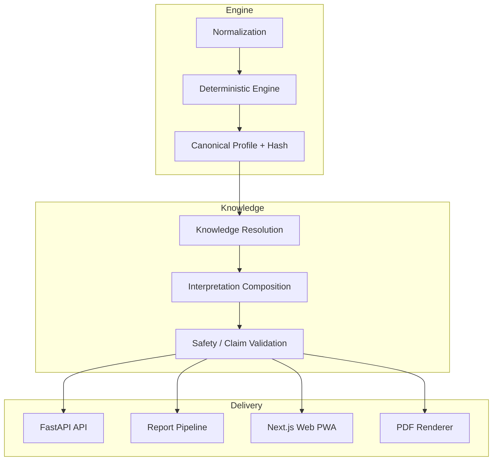

# GAP-Bericht & Technische Schuldenanalyse — numra-v1

**Projekt**: numra-v1 (NUMRA / AVENYTH)
**Pfad**: `e:/VS-code-Projekte-5.2025/numra-v1`
**Datum**: 2026-09-11
**Verifizierter Stand**: WEB-06b (PR #55) und WEB-07 (PR #57) gemergt; nächster Schritt PR-V2-08
**Erstellt von**: Kilo Code, Architect-Mode, Skill `projekt-diagnose`
**Analyseumfang**: alle sieben Bereiche (Architektur, Codequalität, Technische Schulden, Sicherheit, Tests, Dokumentation, Performance/Betrieb)
**Working-Tree-Status**: `UNVERIFIZIERT` — kein `git`-Kommando ausgeführt (Architect-Mode ohne Kommandoausführung). Eine parallel laufende Session im selben Checkout ist ein reales Risiko; der Bericht beschreibt den gelesenen Arbeitsstand, nicht den Commit-Stand.

> **Evidenz lesen:** `GEMESSEN` = in diesem Lauf durch ein Kommando ermittelt · `BERICHTET` = aus einem Repo-Artefakt übernommen, nicht nachgeprüft · `UNVERIFIZIERT` = in diesem Lauf nicht bestimmbar.
> **In diesem Bericht gibt es keine `GEMESSEN`-Werte.** Im Architect-Mode ist keine Kommandoausführung möglich; alle Zahlen stammen aus Repo-Artefakten (`BERICHTET`) oder sind als nicht bestimmbar gekennzeichnet (`UNVERIFIZIERT`). Das vollständige Messprotokoll steht in Anhang A.

---

## 1. Management Summary

`numra-v1` ist ein deterministisches Numerologie-/Beziehungsentwicklungs-Monorepo mit klarer Schichten-Trennung: reine Python-Rechenengines ohne I/O, LLM oder DB; darüber eine stateless FastAPI-Boundary, ein Next.js-PWA-Frontend, ein interner PDF-Renderer und ein generierter TypeScript-Client. Das System ist dokumentations- und teststark (13 ADRs, formale Canon-Spec, 12 Required-CI-Checks, Golden-/Property-/System-E2E-Tests) und produktiv deployed (V1.6 B, Tailnet-only).

Der **verifizierte Stand vom 2026-09-11** ist eindeutig belegt: **WEB-06b** (Configurable Check-ins Frontend, PR #55, Squash-Merge `7e8a1924…`) und **WEB-07** (Shared Tasks UI, PR #57, Squash-Merge `935508c6…`) sind gemergt; PR- und Post-Merge-CI meldeten jeweils **12/12 Required Checks grün** (BERICHTET). **Nächster Schritt ist PR-V2-08 (Roadmaps + Shared Reflection)** — die zugehörige Backend-Migration existiert bereits, der Frontend-/Abschlussstatus ist nicht verifiziert.

**Gesamt-Score: 69/100 (Befriedigend)** — mit der wichtigen Einschränkung, dass **alle sieben Leitmetriken `UNVERIFIZIERT`** sind und damit jeder Bereichs-Score auf **75 gedeckelt** ist. Der Score ist die ehrliche Obergrenze einer ungeprüften Aussage, kein gemessenes Ergebnis.

Zwei **kritische Altlasten** prägen das Bild: (a) die **Astrologie-Engine ist ein reines Typ-Interface** ohne Implementierung (`FEATURE_DISABLED_NO_CANON`, ADR-006) und (b) die **Live-LLM-Verifikation (Ollama) ist unverifiziert** (`LIVE_LLM_SMOKE = NOT_VERIFIED`). Beide betreffen zentrale Produktversprechen. Daneben bestehen bekannte Lücken bei CSP-Härtung, Frontend-Testabdeckung, Produktions-IaC, Monitoring und Dokumentation (CHANGELOG/CONTRIBUTING/Architektur-Diagramm).

**Wichtigste Messlücke:** Es wurden in diesem Lauf **keine Kommandos ausgeführt**. Für belastbare `GEMESSEN`-Werte (Inventar, Musterscan, Git-Metriken, Abhängigkeits-Audits, Coverage) ist ein Folge-Lauf mit Kommandoausführung nötig — siehe §8.

### 1.1 Gesamtbewertung

| Metrik | Wert | Evidenz |
|---|---|---|
| **Gesamt-Score** | **69 / 100** | berechnet aus BERICHTET-Befunden, alle Leitmetriken UNVERIFIZIERT |
| Einstufung | Befriedigend | — |
| Befunde gesamt | 24 (2 kritisch, 6 hoch) | BERICHTET |
| Ungemessene Leitmetriken | 7 von 7 | UNVERIFIZIERT |
| Bereichs-Scores | 6 von 7 am Evidenz-Deckel 75 | — |

> Der Gesamt-Score verdichtet sieben heterogene Bereiche zu einer Zahl. Er eignet sich zum Vergleich desselben Projekts über die Zeit und zum Auffinden des schwächsten Bereichs — nicht zum Vergleich verschiedener Projekte und nicht als Freigabekriterium. Die fachliche Richtigkeit des Codes prüft diese Diagnose an keiner Stelle.

### 1.2 Einzelbewertungen

| Bereich | Score | Gewicht | Beitrag | Einstufung | Leitmetrik-Evidenz |
|---|---|---|---|---|---|
| Projektstruktur & Architektur | 56/100 | 10 % | 5,6 | Mangelhaft | UNVERIFIZIERT (inventar.py nicht gelaufen) |
| Codequalität | 75/100 (Deckel) | 20 % | 15,0 | Gut (gedeckelt) | UNVERIFIZIERT (inventar.py nicht gelaufen) |
| Technische Schulden | 75/100 (Deckel) | 20 % | 15,0 | Gut (gedeckelt) | UNVERIFIZIERT (Outdated-Kommando nicht gelaufen) |
| Sicherheit | 54/100 | 20 % | 10,8 | Mangelhaft | UNVERIFIZIERT (Audit-Kommando nicht gelaufen) |
| Tests & Qualitätssicherung | 75/100 (Deckel) | 15 % | 11,25 | Gut (gedeckelt) | UNVERIFIZIERT (Coverage nicht gemessen) |
| Dokumentation | 75/100 (Deckel) | 5 % | 3,75 | Gut (gedeckelt) | UNVERIFIZIERT (inventar.py nicht gelaufen) |
| Performance & Wartbarkeit | 75/100 (Deckel) | 10 % | 7,5 | Gut (gedeckelt) | UNVERIFIZIERT (muster_scan.py nicht gelaufen) |
| **Gesamt** | **69/100** | 100 % | **68,9** | **Befriedigend** | — |

**Deckel-Hinweis:** Sechs Bereiche liegen rechnerisch über 75 und wurden auf 75 gedeckelt, weil ihre Leitmetrik nicht `GEMESSEN` ist. Architektur (56) und Sicherheit (54) liegen unter dem Deckel; ihre Abzüge tragen die kritischen Befunde ARCH-001 und SEC-001.

### 1.3 Widersprüche (FLAGs)

Befunde, die einer anderen Quelle widersprechen. Beide Seiten sind benannt, keine ist als richtig gesetzt — diese Punkte brauchen eine menschliche Entscheidung.

| # | Befund | Quelle A | Quelle B |
|---|---|---|---|
| FLAG-001 | Frontend-Testlage: „Kern-Komponenten ungetestet, nur 9 Unit-Dateien" vs. aktueller Verzeichnisstand mit deutlich mehr Testdateien (u. a. AppShell-Nav, Auth-Context, Check-ins, Tasks) | [`docs/analyze/gap-analyse.md`](docs/analyze/gap-analyse.md:198) (Stand 2026-08-23) | Verzeichnisauflistung `apps/web/src` (Stand 2026-09-11), z. B. [`app-shell-v2-nav.test.tsx`](apps/web/src/components/layout/__tests__/app-shell-v2-nav.test.tsx), [`auth-context.test.tsx`](apps/web/src/lib/__tests__/auth-context.test.tsx) |
| FLAG-002 | CI-Job-Anzahl: „13 Jobs" vs. 12 Jobs in der Workflow-Datei | [`docs/analyze/gap-analyse.md`](docs/analyze/gap-analyse.md:175) | [`ci.yml`](.github/workflows/ci.yml:13) — 12 Job-Definitionen ausgezählt (BERICHTET) |
| FLAG-003 | Testanzahl: „301 Tests gesamt" vs. 747 Python-Tests + 261 Web-Tests | [`docs/analyze/gap-analyse.md`](docs/analyze/gap-analyse.md:189) (Stand 2026-08-23) | [`plans/projektueberblick.md`](plans/projektueberblick.md:125) und [`pr-web-07-evidence.md`](docs/planning/pr-web-07-evidence.md:24) (Stand 2026-09-11) |

FLAG-003 ist vermutlich eine zeitliche Entwicklung (Testwachstum zwischen den Ständen), FLAG-001 und FLAG-002 sind echte Bezugsgrößen-Differenzen. Keine Seite wird stillschweigend als wahr gesetzt.

---

## 2. Scope

### 2.1 Untersuchungsgegenstand

| Dimension | Umfang |
|---|---|
| Repository | `numra-v1` (Monorepo, pnpm-Workspace + uv-Workspace) |
| Analysierte Artefakte | Manifeste, CI-Workflow, ADRs 001–013, Specs, Planning-/Evidence-Dokumente, README, Verzeichnisstruktur, Testdateilisten |
| Referenzstand | 2026-09-11, verifizierter Implementierungs-`main` `935508c645bb8a923f958bfab5d34b5aacdb5af9` (BERICHTET) |
| Ausgeschlossen | Laufzeit-/Lastanalyse, Profiling, Penetrationstests, fachliche Richtigkeit der Numerologie, Bewertung von Geschäftslogik gegen Anforderungen |

### 2.2 Abgrenzung dieses Laufs

- **Keine Kommandoausführung.** Der Architect-Mode erlaubt keine Terminal-Kommandos; damit entfallen alle Skript-Metriken (`inventar.py`, `git_metriken.py`, `muster_scan.py`), Abhängigkeits-Audits (`pnpm audit`, `pip-audit`), Outdated-Checks und Coverage-Messungen.
- **Keine Geheimniswerte.** `.env`-Dateien und Zugangsdaten werden ausschließlich über ihre Existenz bzw. ihren Bezeichnernamen gemeldet, nie über ihren Inhalt.
- **Repository unverändert.** Es wurde ausschließlich gelesen; geschrieben wurde nur dieser Bericht.

### 2.3 Bezug zum Skill `projekt-diagnose`

Der Bericht folgt der Methodik des Skills `projekt-diagnose` (Evidenzpflicht, Belegpflicht, Geheimnis-Regel, Unverändert-Regel) und übernimmt dessen Score-Rubrik. Abweichend von der Skill-Vorlage folgt die Abschnittsstruktur der expliziten Nutzeranforderung (Management Summary, Scope, Methodik, Ist-Stand, Technische Schulden, GAP-Analyse, priorisierte Maßnahmen, Messlücken und nächste Schritte).

---

## 3. Methodik

### 3.1 Vorgehen

1. **Orientierung**: Verzeichnisstruktur, Manifeste ([`package.json`](package.json), [`pyproject.toml`](pyproject.toml), [`pnpm-workspace.yaml`](pnpm-workspace.yaml)), CI-Workflow, README, ADR-Bestand.
2. **Artefakt-Recherche**: bestehende Analyse-Dokumente ([`gap-analyse.md`](docs/analyze/gap-analyse.md), [`technical-debt.md`](docs/analyze/technical-debt.md)), Planning-/Evidence-Dokumente ([`avenyth-web-execution-state.md`](docs/planning/avenyth-web-execution-state.md), [`pr-web-06b-evidence.md`](docs/planning/pr-web-06b-evidence.md), [`pr-web-07-evidence.md`](docs/planning/pr-web-07-evidence.md)), Projektüberblick ([`plans/projektueberblick.md`](plans/projektueberblick.md)).
3. **Strukturprüfung**: Verzeichnisauflistung `apps/web/src` (Testdateien je Komponente), Alembic-Migrationsliste `apps/api/alembic/versions`.
4. **Ist-Soll-Vergleich** über sieben Bereiche mit Evidenzstufen je Aussage.
5. **Score-Berechnung** nach Skill-Rubrik (Start 100, Abzug je Befund, Evidenz-Deckel 75).

### 3.2 Evidenzstufen

| Stufe | Bedeutung | Verwendung in diesem Bericht |
|---|---|---|
| `GEMESSEN` | in diesem Lauf durch ein Kommando erzeugt | **keine** — es wurden keine Kommandos ausgeführt |
| `BERICHTET` | aus einem Repo-Artefakt übernommen, nicht nachgeprüft | Status-, Test-, CI- und Befundangaben mit Datei:Zeile |
| `UNVERIFIZIERT` | in diesem Lauf nicht bestimmbar | alle Skript-Metriken, Audits, Coverage, Working-Tree-Status |

**Score-Deckel:** Ein Bereichs-Score über 75 setzt `GEMESSEN`-Evidenz für die Leitmetrik des Bereichs voraus. Da keine Leitmetrik gemessen wurde, sind sechs von sieben Bereichen auf 75 gedeckelt. Das ist korrekt und kein Mangel des Projekts, sondern die ehrliche Obergrenze einer ungeprüften Aussage.

### 3.3 Grenzen

- Statische Lese-Analyse: Struktur, Manifeste, ADRs, Specs, Planning-/Release-Dokumente, CI-Konfiguration, Verzeichnisauflistungen.
- Nicht durchgeführt: Laufzeit- und Lastanalyse, Profiling, Penetrationstests, Prüfung der fachlichen Richtigkeit, Bewertung von Geschäftslogik gegen Anforderungen.
- Ein leerer Befundbereich bedeutet, dass die genannten Prüfungen nichts gefunden haben — nicht, dass es nichts zu finden gibt.
- Die Verzeichnisauflistung von `apps/web/src` war am Ende abgeschnitten (truncated); Aussagen über „fehlende" Testdateien sind daher Indizien, keine Vollständigkeitsbeweise.

---

## 4. Ist-Stand

### 4.1 Verifizierter Implementierungsstand (BERICHTET)

| Meilenstein | Status | Beleg |
|---|---|---|
| V1.5 Produktabschluss | abgeschlossen | [`docs/adr/007-v1-5-product-completion.md`](docs/adr/007-v1-5-product-completion.md) |
| V1.6 A (RBAC + Admin-Backend) | abgeschlossen | [`README.md`](README.md:190) |
| V1.6 B (Public Platform + Admin Console) | abgeschlossen, live | [`docs/releases/v1.6-b.md`](docs/releases/v1.6-b.md) |
| V2 Phase 0 (Spec-Freeze) | abgeschlossen | [`specs/v2/architecture.md`](specs/v2/architecture.md) |
| V2 Segment B (PR-WEB-01–04) | abgeschlossen | [`docs/planning/reality-check-2-closure.md`](docs/planning/reality-check-2-closure.md) |
| V2 Segment C — WEB-05 (Relationship/Shadow) | gemergt (#48, #50) | [`avenyth-web-execution-state.md`](docs/planning/avenyth-web-execution-state.md) |
| V2 Segment C — WEB-06a (Check-ins Backend) | gemergt (PR #53) | [`pr-web-06a-evidence.md`](docs/planning/pr-web-06a-evidence.md) |
| V2 Segment C — WEB-06b (Check-ins Frontend) | **gemergt (PR #55)** | [`pr-web-06b-evidence.md`](docs/planning/pr-web-06b-evidence.md:44) |
| V2 Segment C — WEB-07 (Shared Tasks UI) | **gemergt (PR #57)** | [`pr-web-07-evidence.md`](docs/planning/pr-web-07-evidence.md:46) |
| V2 Segment C — PR-V2-08 (Roadmaps + Shared Reflection) | **offen, nächster Schritt** | [`avenyth-web-execution-state.md`](docs/planning/avenyth-web-execution-state.md:10) |

**Verifizierte Referenzen (BERICHTET):**

- `VERIFIED_IMPLEMENTATION_MAIN_SHA`: `935508c645bb8a923f958bfab5d34b5aacdb5af9` ([`avenyth-web-execution-state.md`](docs/planning/avenyth-web-execution-state.md:4))
- WEB-06b: Finaler PR-Head `98986b782fd93195dd443b0b8433232975314938`, Squash-Merge `7e8a19247457deacb5ac62f6edbc9c65925f452e`, PR-CI [34540062199](https://github.com/GoLukeEnviro/numra-v1/actions/runs/34540062199), Post-Merge-CI [34540846280](https://github.com/GoLukeEnviro/numra-v1/actions/runs/34540846280) — jeweils 12/12 Checks grün ([`pr-web-06b-evidence.md`](docs/planning/pr-web-06b-evidence.md:44))
- WEB-07: Finaler PR-Head `ea2ffad676b7d6b9dd3a2ad4d8c2e8c39ac1be6a`, Squash-Merge `935508c645bb8a923f958bfab5d34b5aacdb5af9`, PR-CI [34564656299](https://github.com/GoLukeEnviro/numra-v1/actions/runs/34564656299), Post-Merge-CI [34565329664](https://github.com/GoLukeEnviro/numra-v1/actions/runs/34565329664) — jeweils 12/12 Checks grün ([`pr-web-07-evidence.md`](docs/planning/pr-web-07-evidence.md:46))
- Offene Blocker: keine ([`avenyth-web-execution-state.md`](docs/planning/avenyth-web-execution-state.md:12))
- Kein Produktionsdeployment und keine Aktivierung eines Produktionsflags in beiden PRs ([`pr-web-06b-evidence.md`](docs/planning/pr-web-06b-evidence.md:53), [`pr-web-07-evidence.md`](docs/planning/pr-web-07-evidence.md:51))

**PR-V2-08 (nächster Schritt):** Die Backend-Migration [`e2f3a4b5c6d7_roadmaps_shared_reflection.py`](apps/api/alembic/versions/e2f3a4b5c6d7_roadmaps_shared_reflection.py) existiert bereits im Repo (BERICHTET aus Verzeichnisauflistung). Der Frontend-/Abschlussstatus ist `UNVERIFIZIERT` — aus den vorliegenden Artefakten nicht bestimmbar.

### 4.2 Architektur & Stack (BERICHTET)

- **Monorepo** mit klarer Schichten-Trennung; Importordnung `numra_numerology → numra_interpretation → numra_relationship_interpretation → numra_api` ([`README.md`](README.md:41), [`plans/projektueberblick.md`](plans/projektueberblick.md:41))
- **Python**: uv-Workspace, Python 3.11+, ruff (line-length 100), mypy `--strict`, pytest + hypothesis + pytest-cov ([`pyproject.toml`](pyproject.toml))
- **Node**: pnpm@9.15.0, Node 20+, Workspaces `apps/web`, `apps/pdf`, `packages/schema` ([`package.json`](package.json:4), [`pnpm-workspace.yaml`](pnpm-workspace.yaml))
- **Infra**: Docker Compose mit 7 Services ([`docker-compose.yml`](docker-compose.yml))
- **ADR-Bestand**: 13 ADRs (001–013) in [`docs/adr/`](docs/adr) — die ältere Gap-Analyse nennt noch 7 (Stand 2026-08-23); die V2-ADRs 008–013 kamen seither hinzu (BERICHTET aus Verzeichnisauflistung)
- **V2-Invarianten**: additiver Ausbau, kein Parallel-Stack; Feature-Flags in Produktion deaktiviert bis zum jeweiligen Acceptance-Gate ([`specs/v2/architecture.md`](specs/v2/architecture.md))

### 4.3 CI/CD (BERICHTET)

12 Required Checks in [`.github/workflows/ci.yml`](.github/workflows/ci.yml:13):

| # | Job | Zweck | Fundstelle |
|---|---|---|---|
| 1 | `lint-python` | ruff format + check | [`ci.yml`](.github/workflows/ci.yml:14) |
| 2 | `python-typecheck` | mypy --strict | [`ci.yml`](.github/workflows/ci.yml:26) |
| 3 | `unit-and-property-tests` | Postgres/Redis, Engine-Coverage ≥90 % | [`ci.yml`](.github/workflows/ci.yml:40) |
| 4 | `no-golden-leakage` | Anti-Leak-Test | [`ci.yml`](.github/workflows/ci.yml:96) |
| 5 | `dependency-security` | `pnpm audit --prod --audit-level=high` + `pip-audit` | [`ci.yml`](.github/workflows/ci.yml:107) |
| 6 | `schema-and-openapi-drift` | Schema-/Client-Drift | [`ci.yml`](.github/workflows/ci.yml:131) |
| 7 | `web-lint-typecheck-build-test` | Web-Qualitätstor | [`ci.yml`](.github/workflows/ci.yml:162) |
| 8 | `playwright` | gemockte Browser-Journey | [`ci.yml`](.github/workflows/ci.yml:177) |
| 9 | `pdf-service-tests` | PDF-Renderer-Tests | [`ci.yml`](.github/workflows/ci.yml:191) |
| 10 | `system-e2e` | echter Stack, kein Mocking | [`ci.yml`](.github/workflows/ci.yml:204) |
| 11 | `docker-build` | Image-Builds | [`ci.yml`](.github/workflows/ci.yml:324) |
| 12 | `docker-compose-e2e` | Compose-Topologie + Log-/Secret-Audit | [`ci.yml`](.github/workflows/ci.yml:338) |

Zusätzlich: `rc2-journey.yml` (Workflow-Dispatch, Zwei-Konten-Journey). Coverage-Gate existiert nur für die Engine (`--cov-fail-under=90`, [`ci.yml`](.github/workflows/ci.yml:89)); für API und Web wird kein Schwellwert erzwungen.

### 4.4 Testlage (BERICHTET)

| Metrik | Wert | Quelle |
|---|---|---|
| Python-Vollsuite | 747 passed (WEB-06a-Abschluss) | [`plans/projektueberblick.md`](plans/projektueberblick.md:125) |
| Engine-Coverage | 100 % (110 Tests), Gate ≥90 % | [`plans/projektueberblick.md`](plans/projektueberblick.md:125) |
| Web-Suite (WEB-07-Stand) | 261 Tests / 58 Dateien | [`pr-web-07-evidence.md`](docs/planning/pr-web-07-evidence.md:24) |
| Web-Suite (WEB-06b-Stand) | 255 Tests / 57 Dateien | [`pr-web-06b-evidence.md`](docs/planning/pr-web-06b-evidence.md:23) |
| Alembic-Migrationssuite | 10 passed | [`plans/projektueberblick.md`](plans/projektueberblick.md:127) |
| Coverage Web/API | `UNVERIFIZIERT` — kein Coverage-Artefakt gesichtet, keine Messung freigegeben | — |

Testdateien sind komponentennah organisiert (je `__tests__`-Verzeichnis), u. a. für Check-ins ([`checkins-content.test.tsx`](apps/web/src/components/workspaces/checkins/__tests__/checkins-content.test.tsx)), Tasks ([`workspace-tasks-content.test.tsx`](apps/web/src/components/workspaces/tasks/__tests__/workspace-tasks-content.test.tsx)), AppShell-Navigation ([`app-shell-v2-nav.test.tsx`](apps/web/src/components/layout/__tests__/app-shell-v2-nav.test.tsx)) und Auth-Context ([`auth-context.test.tsx`](apps/web/src/lib/__tests__/auth-context.test.tsx)).

### 4.5 Sicherheit (BERICHTET)

- Argon2id-Passwort-Hashing; Session-Tokens nur als SHA-256-Hash gespeichert; Cookies `HttpOnly`/`SameSite=Lax`/`Secure` (Prod) ([`README.md`](README.md:225))
- CSRF via Double-Submit-Cookie auf allen zustandsändernden Requests ([`README.md`](README.md:227))
- `ALLOW_SELF_SIGNUP` default `false`; Anti-Enumeration bei Login/Registrierung ([`README.md`](README.md:229))
- PII-sicheres Logging ([`README.md`](README.md:233))
- Dependency-Audit als CI-Gate ([`ci.yml`](.github/workflows/ci.yml:107))
- Kein echtes `.env` im Repo (nur [`.env.example`](.env.example)) — Existenzprüfung, Inhalt nicht gelesen
- **Abhängigkeits-Schwachstellen**: `UNVERIFIZIERT` — kein Audit-Kommando in diesem Lauf ausgeführt

### 4.6 Dokumentation (BERICHTET)

- README mit Beschreibung, Setup, Nutzung, Security-/Privacy-Notes ([`README.md`](README.md))
- 13 ADRs, Canon-Spec ([`specs/canon-spec.md`](specs/canon-spec.md)), OpenAPI ([`openapi/numra-v1.json`](openapi/numra-v1.json)), Phasen-Evidenz ([`specs/evidence/`](specs/evidence))
- **Fehlend**: `CHANGELOG.md`, `CONTRIBUTING.md`, `docs/architecture.md` (BERICHTET, [`docs/analyze/gap-analyse.md`](docs/analyze/gap-analyse.md:210))
- Kommentarquote: `UNVERIFIZIERT` — `inventar.py` nicht gelaufen

---

## 5. Technische Schulden

Legende Schwere: `kritisch` · `hoch` · `mittel` · `niedrig`. Jeder Befund nennt Fundstelle und Evidenzstufe. Aufwandsklassen (gering/mittel/hoch/sehr_hoch) sind relative Einordnungen, keine Zeitschätzungen.

### 5.1 Architektur

| ID | Befund | Schwere | Fundstelle | Evidenz |
|---|---|---|---|---|
| ARCH-001 | Astrologie-Engine ist reines Typ-Interface, wirft `NotImplementedError` (`FEATURE_DISABLED_NO_CANON`, ADR-006) — Produktversprechen unerfüllt | kritisch | [`README.md`](README.md:31), [`docs/adr/006-unfrozen-features.md`](docs/adr/006-unfrozen-features.md), [`gap-analyse.md`](docs/analyze/gap-analyse.md:101) | BERICHTET |
| ARCH-002 | Doku/Code-Divergenz um RBAC/Admin (V1.6): Release-Runbook referenziert Stand, der im Repo nur eingeschränkt sichtbar ist | hoch | [`gap-analyse.md`](docs/analyze/gap-analyse.md:102), [`technical-debt.md`](docs/analyze/technical-debt.md:83) | BERICHTET |
| ARCH-003 | Kein `docs/architecture.md` mit pflegebarem Diagramm; Architektur nur in Textform (README/ADRs) | mittel | [`gap-analyse.md`](docs/analyze/gap-analyse.md:103) | BERICHTET |
| ARCH-004 | V2-Phasen teils Backend-vor-Frontend: Migrationen für Roadmaps/Shared Reflection, Copilot, Evidence Layer existieren, Frontend-/Abschlussstatus offen | mittel | [`apps/api/alembic/versions/`](apps/api/alembic/versions/e2f3a4b5c6d7_roadmaps_shared_reflection.py), [`plans/projektueberblick.md`](plans/projektueberblick.md:151) | BERICHTET |
| ARCH-005 | Zyklische Importe / God-Module | — | `inventar.py` nicht gelaufen | UNVERIFIZIERT |

**Score Architektur: 56/100** — Abzüge: ARCH-001 (−25), ARCH-002 (−12), ARCH-003 (−5), ARCH-004 (−2). Unter dem Deckel; die kritische Altlast trägt den Ausschlag.

### 5.2 Code-Qualität

| ID | Befund | Schwere | Fundstelle | Evidenz |
|---|---|---|---|---|
| CQ-001 | Lange Funktionen: `EditPersonForm` (243 Z.), `pipeline._generate_section` (152 Z.), weitere | mittel | [`gap-analyse.md`](docs/analyze/gap-analyse.md:113), [`technical-debt.md`](docs/analyze/technical-debt.md:74) | BERICHTET |
| CQ-002 | Duplizierte Personen-Form-Logik zwischen `people/new` und `people/[id]/edit` (Blöcke mit 47/45/29/16 Z.) | mittel | [`gap-analyse.md`](docs/analyze/gap-analyse.md:114) | BERICHTET |
| CQ-003 | `print` statt Logging in CLI/Scripts (17 Treffer) | niedrig | [`gap-analyse.md`](docs/analyze/gap-analyse.md:115) | BERICHTET |
| CQ-004 | Viele Parameter: `create_report_with_job` (10), `create_calculation` (8), `_generate_section` (8) | niedrig | [`gap-analyse.md`](docs/analyze/gap-analyse.md:116) | BERICHTET |
| CQ-005 | Große Dateien: u. a. [`checkins-content.tsx`](apps/web/src/components/workspaces/checkins/checkins-content.tsx) (24.005 Zeichen), [`client.ts`](apps/web/src/api/client.ts) (43.006 Zeichen) — Zeilenzahl nicht gemessen | — | Verzeichnisauflistung (Zeichenzahl BERICHTET, Zeilen UNVERIFIZIERT) | UNVERIFIZIERT |
| CQ-006 | Duplikate, Verschachtelungstiefe, Kommentarquote | — | `inventar.py` nicht gelaufen | UNVERIFIZIERT |

**Score Code-Qualität: 90 → gedeckelt 75** — Abzüge: CQ-001 (−5), CQ-002 (−2), CQ-003 (−2), CQ-004 (−1). Deckel greift (Leitmetrik nicht gemessen).

### 5.3 Tests

| ID | Befund | Schwere | Fundstelle | Evidenz |
|---|---|---|---|---|
| TEST-001 | Frontend-Testlücke teilweise adressiert: Für Kern-Screens wie [`login/page.tsx`](apps/web/src/app/login/page.tsx), [`people/[id]/page.tsx`](apps/web/src/app/people/[id]/page.tsx), [`person-form.tsx`](apps/web/src/components/people/person-form.tsx) ist in der Verzeichnisauflistung kein Testverzeichnis sichtbar (Auflistung truncated) | hoch | Verzeichnisauflistung `apps/web/src`; Widerspruch zu FLAG-001 | BERICHTET (Indiz) |
| TEST-002 | `engine-interpretation` nur Unit-Tests; kein integration/golden/property für pipeline/composer | mittel | [`gap-analyse.md`](docs/analyze/gap-analyse.md:199) | BERICHTET |
| TEST-003 | PDF-Suite minimal (4 Tests, nur `render.test.js`) | mittel | [`gap-analyse.md`](docs/analyze/gap-analyse.md:201) | BERICHTET |
| TEST-004 | Coverage-Gate nur für Engine; kein Schwellwert für API/Web | mittel | [`ci.yml`](.github/workflows/ci.yml:89), [`gap-analyse.md`](docs/analyze/gap-analyse.md:202) | BERICHTET |
| TEST-005 | Coverage Web/API | — | keine Messung freigegeben/ausgeführt | UNVERIFIZIERT |

**Score Tests: 79 → gedeckelt 75** — Abzüge: TEST-001 (−12), TEST-002 (−5), TEST-003 (−2), TEST-004 (−2). Deckel greift (Coverage nicht gemessen).

### 5.4 Dokumentation

| ID | Befund | Schwere | Fundstelle | Evidenz |
|---|---|---|---|---|
| DOC-001 | Kein `CHANGELOG.md` | mittel | [`gap-analyse.md`](docs/analyze/gap-analyse.md:215) | BERICHTET |
| DOC-002 | Kein `docs/architecture.md` (Diagramm) | mittel | [`gap-analyse.md`](docs/analyze/gap-analyse.md:216) | BERICHTET |
| DOC-003 | Kein `CONTRIBUTING.md` | mittel | [`gap-analyse.md`](docs/analyze/gap-analyse.md:217) | BERICHTET |
| DOC-004 | Kein menschliches API-Handbuch (nur OpenAPI-Spec) | mittel | [`gap-analyse.md`](docs/analyze/gap-analyse.md:218) | BERICHTET |
| DOC-005 | Deployment-Manifest nicht im Repo versioniert | hoch | [`gap-analyse.md`](docs/analyze/gap-analyse.md:219), [`technical-debt.md`](docs/analyze/technical-debt.md:107) | BERICHTET |
| DOC-006 | Kommentarquote / unterdokumentierte Dateien | — | `inventar.py` nicht gelaufen | UNVERIFIZIERT |

**Score Dokumentation: 77 → gedeckelt 75** — Abzüge: DOC-001 (−5), DOC-002 (−2), DOC-003 (−2), DOC-004 (−2), DOC-005 (−12). Deckel greift.

### 5.5 Abhängigkeiten

| ID | Befund | Schwere | Fundstelle | Evidenz |
|---|---|---|---|---|
| DEP-001 | Kein Renovate/Dependabot; Versionen gepinnt, aber keine automatischen Update-Bots | mittel | [`gap-analyse.md`](docs/analyze/gap-analyse.md:185), [`technical-debt.md`](docs/analyze/technical-debt.md:113) | BERICHTET |
| DEP-002 | Playwright-Versionsdrift (pdf) war vorhanden, wurde durch Pinning behoben | niedrig | [`technical-debt.md`](docs/analyze/technical-debt.md:114) | BERICHTET |
| DEP-003 | Veraltete direkte Abhängigkeiten (Major/Minor/Patch) | — | `pnpm outdated` / `uv pip list --outdated` nicht gelaufen | UNVERIFIZIERT |
| DEP-004 | Bekannte Schwachstellen der Abhängigkeiten | — | `pnpm audit` / `pip-audit` nicht gelaufen | UNVERIFIZIERT |

**Score Technische Schulden: 93 → gedeckelt 75** — Abzüge: DEP-001 (−5), DEP-002 (−2). Deckel greift (Outdated-Kommando nicht gelaufen).

### 5.6 Sicherheit

| ID | Befund | Schwere | Fundstelle | Evidenz |
|---|---|---|---|---|
| SEC-001 | Live-LLM-Verifikation (Ollama) unverifiziert: `LIVE_LLM_SMOKE = NOT_VERIFIED` (fehlender API-Key in CI) | kritisch | [`gap-analyse.md`](docs/analyze/gap-analyse.md:142), [`technical-debt.md`](docs/analyze/technical-debt.md:120) | BERICHTET |
| SEC-002 | CSP ohne `nonce`/`strict-dynamic` (`script-src 'self' 'unsafe-inline'`) | hoch | [`gap-analyse.md`](docs/analyze/gap-analyse.md:143), [`plans/projektueberblick.md`](plans/projektueberblick.md:200) | BERICHTET |
| SEC-003 | Kein SAST-Job im CI (nur Dependency-Audit) | mittel | [`gap-analyse.md`](docs/analyze/gap-analyse.md:144) | BERICHTET |
| SEC-004 | Zugangsdaten-Bezeichner in CI-/Dev-Konfigurationen (z. B. `POSTGRES_PASSWORD` in [`ci.yml`](.github/workflows/ci.yml:47), DB-URLs in Compose/Conftest) — CI-/Testwerte, kein reales Leck; Werte nicht ausgelesen | mittel | [`gap-analyse.md`](docs/analyze/gap-analyse.md:145), [`technical-debt.md`](docs/analyze/technical-debt.md:123) | BERICHTET |
| SEC-005 | Fehlender Audit-/Incident-Prozess im Ops-Runbook | niedrig | [`gap-analyse.md`](docs/analyze/gap-analyse.md:146) | BERICHTET |
| SEC-006 | Verwundbare Abhängigkeiten (CVE-Lage) | — | Audit-Kommando nicht gelaufen; keine CVE-Aussage aus Erinnerungswissen | UNVERIFIZIERT |

**Score Sicherheit: 54/100** — Abzüge: SEC-001 (−25), SEC-002 (−12), SEC-003 (−5), SEC-004 (−2), SEC-005 (−2). Unter dem Deckel; die unverifizierte LLM-Kette trägt den Ausschlag.

### 5.7 Betrieb

| ID | Befund | Schwere | Fundstelle | Evidenz |
|---|---|---|---|---|
| OPS-001 | Produktions-Compose (`compose.production.yml`) nur extern auf VPS, nicht im Repo versioniert | hoch | [`gap-analyse.md`](docs/analyze/gap-analyse.md:169), [`technical-debt.md`](docs/analyze/technical-debt.md:89) | BERICHTET |
| OPS-002 | Kein Monitoring/Alerting, kein Metrik-Export, keine Log-Aggregation | hoch | [`gap-analyse.md`](docs/analyze/gap-analyse.md:170), [`plans/projektueberblick.md`](plans/projektueberblick.md:203) | BERICHTET |
| OPS-003 | Kein Backup-/Retentions-Konzept für Postgres/Exports dokumentiert | hoch | [`gap-analyse.md`](docs/analyze/gap-analyse.md:157) | BERICHTET |
| OPS-004 | Deployment nicht voll automatisiert (Runbook-basiert, kein CD) | hoch | [`gap-analyse.md`](docs/analyze/gap-analyse.md:183) | BERICHTET |
| OPS-005 | Keine Performance-Baseline (keine Last-Tests, keine SLOs) | hoch | [`gap-analyse.md`](docs/analyze/gap-analyse.md:127) | BERICHTET |
| OPS-006 | Frontend-Bundle-Optimierung ungeprüft (kein Bundle-Budget) | mittel | [`gap-analyse.md`](docs/analyze/gap-analyse.md:128) | BERICHTET |
| OPS-007 | LLM-Latenz ohne Timeouts/Cost-Budgets sichtbar | mittel | [`gap-analyse.md`](docs/analyze/gap-analyse.md:129) | BERICHTET |
| OPS-008 | Statischer Musterscan (unsichere Muster, TODO/FIXME) | — | `muster_scan.py` nicht gelaufen | UNVERIFIZIERT |
| OPS-009 | Git-Hotspots, Reverts, Working-Tree-Status | — | `git_metriken.py` nicht gelaufen | UNVERIFIZIERT |

**Score Performance & Wartbarkeit: 81 → gedeckelt 75** — Abzüge: OPS-005 (−12), OPS-006 (−5), OPS-007 (−2). Deckel greift (Musterscan nicht gelaufen).

---

## 6. GAP-Analyse (Soll vs. Ist)

### 6.1 Übersicht

| Bereich | Ist-Zustand | Soll-Zustand | Lücke | Evidenzstufe | Belegt durch |
|---|---|---|---|---|---|
| Architektur | Astrologie nur Interface; RBAC-Doku-Divergenz; kein Architektur-Diagramm | Deterministische Astrologie-Engine gem. Canon; Doku = Repo-Stand; pflegebares Diagramm | ARCH-001, ARCH-002, ARCH-003 | BERICHTET | [`gap-analyse.md`](docs/analyze/gap-analyse.md:101) |
| Code-Qualität | Lange Funktionen, Form-Duplikate, `print`-Logging | Funktionen <30 Z. Richtwert, gemeinsame Form-Abstraktion, strukturiertes Logging | CQ-001…CQ-004 | BERICHTET | [`gap-analyse.md`](docs/analyze/gap-analyse.md:113) |
| Tests | 747 Python + 261 Web grün; Engine-Coverage 100 %; Lücken bei Interpretation/PDF/Web-Coverage | Coverage-Policy für API/Web; Multi-Layer-Tests Interpretation; PDF-Edge-Cases | TEST-001…TEST-004 | BERICHTET | [`pr-web-07-evidence.md`](docs/planning/pr-web-07-evidence.md:24), [`gap-analyse.md`](docs/analyze/gap-analyse.md:198) |
| Dokumentation | README/ADRs/Specs stark; CHANGELOG, CONTRIBUTING, Architektur-Doku, API-Handbuch fehlen | Vollständige Projektdokumentation inkl. Deployment-Manifest | DOC-001…DOC-005 | BERICHTET | [`gap-analyse.md`](docs/analyze/gap-analyse.md:210) |
| Abhängigkeiten | Gepinnt, frozen-lockfile, Audit-Gate; kein Update-Bot; Veraltungsgrad unbekannt | Renovate/Dependabot; bekannte Veraltungs- und CVE-Lage | DEP-001, DEP-003, DEP-004 | BERICHTET / UNVERIFIZIERT | [`technical-debt.md`](docs/analyze/technical-debt.md:113) |
| Sicherheit | Argon2id, CSRF, CSP-Basis, Audit-Gate; LLM-Smoke unverifiziert; CSP ohne nonce; kein SAST | Verifizierter LLM-Pfad; nonce-basiertes CSP; SAST im CI | SEC-001…SEC-003 | BERICHTET | [`gap-analyse.md`](docs/analyze/gap-analyse.md:142) |
| Betrieb | Compose-Dev sauber, Healthchecks; Prod-IaC, Monitoring, Backup, CD, Perf-Baseline fehlen | Reproduzierbares Prod-Deployment, Observability, Backup/Retention, SLOs | OPS-001…OPS-005 | BERICHTET | [`gap-analyse.md`](docs/analyze/gap-analyse.md:169) |

### 6.2 Erläuterung

- **Architektur:** Die Schichtung ist sauber und durch ADRs abgesichert; die kritische Lücke ist die unfertige Astrologie-Engine (Produktversprechen) sowie die Doku-Divergenz um RBAC/Admin. Die V2-Phasen zeigen ein bewusstes Backend-vor-Frontend-Muster (Migrationen existieren vor UI) — das ist per se kein Mangel, erschwert aber die Statusbestimmung einzelner Phasen ohne Frontend-Artefakte.
- **Code-Qualität:** Die BERICHTET-Befunde stammen aus dem Stand 2026-08-23. Ob die seither gemergten PRs (#53, #55, #57) neue lange Funktionen oder Duplikate eingeführt haben, ist `UNVERIFIZIERT` (kein `inventar.py`-Lauf).
- **Tests:** Die Testkultur ist stark (Golden/Property/System-E2E, 12/12 CI-Checks). Die Lücke liegt in der Web-/API-Coverage-Messung und in einzelnen ungetesteten Screens; FLAG-001 markiert den Widerspruch zwischen alter Gap-Analyse und aktuellem Verzeichnisstand.
- **Dokumentation:** Die Lücke ist rein additiv schließbar (CHANGELOG, CONTRIBUTING, Architektur-Diagramm, API-Handbuch) und hat niedriges Risiko.
- **Abhängigkeiten:** Ohne Outdated-/Audit-Lauf ist die Veraltungs- und CVE-Lage nicht bestimmbar; das CI-Gate belegt nur, dass die Pipeline bei Critical/High mit Fix den Build bricht — nicht, dass aktuell keine Funde existieren.
- **Sicherheit:** Die Basis ist solide; die zwei gewichtigsten Punkte sind der unverifizierte Live-LLM-Pfad (kritisch) und die CSP-Schwäche (hoch).
- **Betrieb:** Die größte strukturelle Lücke: kein Prod-IaC im Repo, kein Monitoring, kein Backup-Konzept, kein CD, keine Performance-Baseline. Diese Punkte sind unabhängig vom laufenden V2-Feature-Ausbau.

---

## 7. Priorisierte Maßnahmen

Aufwandsklassen: `gering` · `mittel` · `hoch` · `sehr_hoch` (relative Einordnung, keine Zeitschätzung). Risiko = Risiko bei Nichtbehebung.

### 7.1 Kritisch — sofortiger Handlungsbedarf

| # | Maßnahme | Bereich | Impact | Aufwand | Risiko | Befund-IDs |
|---|---|---|---|---|---|---|
| M-01 | Astrologie: Canon-Spec definieren, deterministische Engine implementieren, Golden-Fixtures aufbauen | Architektur | kritisch | sehr_hoch | Produktversprechen dauerhaft unerfüllt; Integrationskosten wachsen | ARCH-001 |
| M-02 | Live-LLM-Smoke (Ollama) in Staging/CI mit Managed Secret verifizieren | Sicherheit | kritisch | gering | Unverifizierter Produktions-LLM-Pfad | SEC-001 |

### 7.2 Hoch — kurzfristig

| # | Maßnahme | Bereich | Impact | Aufwand | Risiko | Befund-IDs |
|---|---|---|---|---|---|---|
| M-03 | CSP auf `nonce`/`strict-dynamic` migrieren | Sicherheit | hoch | mittel | Erhöhtes XSS-Risiko bei Injections | SEC-002 |
| M-04 | Frontend-Testabdeckung für verbleibende Kern-Screens schließen (Login, People-Detail/Edit, PersonForm) | Tests | hoch | mittel | UI-Regressionen unentdeckt | TEST-001 |
| M-05 | Produktions-Compose + Env-Template ins Repo versionieren; Backup-/Retention-Konzept dokumentieren | Betrieb | hoch | mittel | Reproduzierbarkeit, Drift- und Datenverlustrisiko | OPS-001, OPS-003, DOC-005 |
| M-06 | Monitoring/Alerting + Metrik-Export einführen | Betrieb | hoch | hoch | Blindheit bei Störungen | OPS-002 |
| M-07 | Doku/Code-Divergenz RBAC/Admin bereinigen; Versions-Matrix einführen | Architektur | hoch | gering | Falsche Sicherheits-/Fähigkeitsannahmen | ARCH-002 |
| M-08 | Performance-Baseline (Last-Smoke + SLOs) etablieren | Betrieb | hoch | mittel | Skalierung unvorhersehbar | OPS-005 |

### 7.3 Mittel — mittelfristig

| # | Maßnahme | Bereich | Impact | Aufwand | Risiko | Befund-IDs |
|---|---|---|---|---|---|---|
| M-09 | Renovate/Dependabot konfigurieren | Abhängigkeiten | mittel | gering | Updates bleiben manuell, Alerts ungenutzt | DEP-001 |
| M-10 | CHANGELOG, CONTRIBUTING, Architektur-Diagramm, API-Handbuch anlegen | Dokumentation | mittel | gering | Onboarding-/Nachvollziehbarkeitslücken | DOC-001…DOC-004, ARCH-003 |
| M-11 | Form-Duplikate abstrahieren; lange Funktionen zerlegen | Code-Qualität | mittel | mittel | Wartungs-/Merge-Konflikte, Drift | CQ-001, CQ-002 |
| M-12 | Interpretation: Property-/Integration-Tests ergänzen; PDF-Edge-Cases erweitern | Tests | mittel | mittel | Falsche Komposition/Edge-Fehler unentdeckt | TEST-002, TEST-003 |
| M-13 | Coverage-Policy für API/Web mit Schwellwert etablieren | Tests | mittel | mittel | Kein Qualitätstor außerhalb der Engine | TEST-004 |
| M-14 | SAST-Job (z. B. Semgrep/Bandit) in CI ergänzen | Sicherheit | mittel | mittel | Neue Schwachstellen unentdeckt | SEC-003 |
| M-15 | CD-Pipeline mit Rollback-Pfad aufbauen | Betrieb | mittel | hoch | Release-Geschwindigkeit, manuelle Fehler | OPS-004 |
| M-16 | Bundle-Budget und LLM-Timeouts/Cost-Limits einführen | Betrieb | mittel | gering | Unkontrollierte Latenz/Kosten | OPS-006, OPS-007 |

### 7.4 Niedrig — langfristig

| # | Maßnahme | Bereich | Impact | Aufwand | Risiko | Befund-IDs |
|---|---|---|---|---|---|---|
| M-17 | `print` durch strukturiertes Logging in CLI/Scripts ersetzen | Code-Qualität | niedrig | gering | Eingeschränkte Debug-Observability | CQ-003 |
| M-18 | Parameter-Objekte für Funktionen mit >5 Parametern einführen | Code-Qualität | niedrig | gering | Lesbarkeit, Testaufwand | CQ-004 |
| M-19 | Dev-Credentials in Compose/CI vollständig auf Env ohne Defaults härten | Sicherheit | niedrig | gering | Leak-Gefahr bei Fehlkonfiguration | SEC-004 |
| M-20 | Audit-/Incident-Prozess im Ops-Runbook ergänzen | Sicherheit | niedrig | gering | Fehlende Prozessklarheit | SEC-005 |

---

## 8. Messlücken und nächste Schritte

### 8.1 Messlücken (für einen Folge-Lauf mit Kommandoausführung)

| # | Ungemessene Leitmetrik | Notwendiges Kommando | Warum sie fehlt |
|---|---|---|---|
| ML-01 | Zyklische Importe, God-Module, große Dateien, lange Funktionen, Duplikate, Test-/Prod-Verhältnis, Kommentarquote | `python <skill>/scripts/inventar.py .` | Architect-Mode ohne Kommandoausführung |
| ML-02 | Git-Hotspots, Reverts, Commit-Zahlen, Working-Tree-Status | `python <skill>/scripts/git_metriken.py .` | dito |
| ML-03 | TODO/FIXME, unsichere Muster, Geheimnis-Indikatoren | `python <skill>/scripts/muster_scan.py .` | dito |
| ML-04 | Veraltete Node-Abhängigkeiten | `pnpm outdated` | dito |
| ML-05 | Veraltete Python-Abhängigkeiten | `uv pip list --outdated` | dito |
| ML-06 | Node-Abhängigkeits-Schwachstellen | `pnpm audit --json` | dito |
| ML-07 | Python-Abhängigkeits-Schwachstellen | `uvx pip-audit --format json` | dito |
| ML-08 | Python-Coverage (Engine/API/Interpretation) | `uv run pytest packages apps/api/tests --cov --cov-report=xml` | dito; erzeugt Artefakte, Freigabe nötig |
| ML-09 | Web-Coverage | `pnpm --filter @numra/web test -- --coverage` | dito; erzeugt Artefakte, Freigabe nötig |
| ML-10 | Befund-Validierung | `python <skill>/scripts/validiere_befunde.py befunde.json` | dito; setzt `befunde.json` voraus |

**Hinweis:** Die Skill-Skripte liegen unter `C:\Users\CodeLuke\.kilocode\skills\projekt-diagnose\scripts\`. Der Folge-Lauf sollte in einem Modus mit Kommandoausführung (z. B. Debug oder Code) erfolgen und die Ergebnisse als `GEMESSEN` in einen aktualisierten Bericht überführen.

### 8.2 Nächste Schritte

1. **PR-V2-08 (Roadmaps + Shared Reflection) planen und umsetzen** — der laut Execution State nächste Abschnitt. Die Backend-Migration [`e2f3a4b5c6d7_roadmaps_shared_reflection.py`](apps/api/alembic/versions/e2f3a4b5c6d7_roadmaps_shared_reflection.py) existiert; Frontend-/Abschlussstatus vor Planungsbeginn verifizieren.
2. **Folge-Lauf der Projektdiagnose mit Kommandoausführung** (ML-01 bis ML-10) — hebt die Evidenz-Deckel auf und ersetzt die BERICHTET-Werte durch GEMESSEN-Werte.
3. **Kritische Altlasten adressieren** (M-01, M-02) — unabhängig vom laufenden V2-Ausbau.
4. **FLAG-001 bis FLAG-003 menschlich entscheiden** — insbesondere die Frontend-Testlage (FLAG-001) vor der nächsten Testplanung klären.
5. **Betriebs-Lücken priorisieren** (M-05, M-06, M-08) — Prod-IaC, Monitoring und Performance-Baseline sind die größten strukturellen Risiken jenseits des Feature-Ausbaus.

---

## Anhang

### A. Messprotokoll

Jedes Kommando dieses Laufs. Alles, was hier nicht mit `OK` steht, konnte nicht gemessen werden und erscheint im Bericht als `BERICHTET` oder `UNVERIFIZIERT`.

| Kommando | Zweck | Status | Grund |
|---|---|---|---|
| `python --version` | Werkzeugprüfung | nicht ausgeführt | Architect-Mode ohne Kommandoausführung |
| `git rev-parse --is-inside-work-tree` | Git-Prüfung | nicht ausgeführt | dito |
| `python <skill>/scripts/inventar.py .` | Struktur-/Zeilenmetriken | nicht ausgeführt | dito |
| `python <skill>/scripts/git_metriken.py .` | Hotspots/Reverts/Working Tree | nicht ausgeführt | dito |
| `python <skill>/scripts/muster_scan.py .` | Muster-/Geheimnis-Scan | nicht ausgeführt | dito |
| `pnpm outdated` / `pnpm audit --json` | Node-Abhängigkeiten | nicht ausgeführt | dito |
| `uv pip list --outdated` / `uvx pip-audit` | Python-Abhängigkeiten | nicht ausgeführt | dito |
| Coverage-Kommandos (pytest/vitest) | Coverage | nicht ausgeführt | dito; Freigabe nicht eingeholt |
| `python <skill>/scripts/validiere_befunde.py` | Befund-Validierung | nicht ausgeführt | dito; setzt `befunde.json` voraus |

**Ersatzweise gelesene Quellen (BERICHTET):** [`docs/analyze/gap-analyse.md`](docs/analyze/gap-analyse.md), [`docs/analyze/technical-debt.md`](docs/analyze/technical-debt.md), [`docs/planning/avenyth-web-execution-state.md`](docs/planning/avenyth-web-execution-state.md), [`docs/planning/pr-web-06b-evidence.md`](docs/planning/pr-web-06b-evidence.md), [`docs/planning/pr-web-07-evidence.md`](docs/planning/pr-web-07-evidence.md), [`plans/projektueberblick.md`](plans/projektueberblick.md), [`.github/workflows/ci.yml`](.github/workflows/ci.yml), [`README.md`](README.md), Verzeichnisauflistungen.

### B. Score-Berechnung

| Bereich | Startwert | Abzüge (Befund-IDs) | Roh-Score | Deckel | End-Score |
|---|---|---|---|---|---|
| Architektur | 100 | −25 (ARCH-001), −12 (ARCH-002), −5 (ARCH-003), −2 (ARCH-004) | 56 | 75 | **56** |
| Code-Qualität | 100 | −5 (CQ-001), −2 (CQ-002), −2 (CQ-003), −1 (CQ-004) | 90 | 75 | **75** |
| Technische Schulden | 100 | −5 (DEP-001), −2 (DEP-002) | 93 | 75 | **75** |
| Sicherheit | 100 | −25 (SEC-001), −12 (SEC-002), −5 (SEC-003), −2 (SEC-004), −2 (SEC-005) | 54 | 75 | **54** |
| Tests | 100 | −12 (TEST-001), −5 (TEST-002), −2 (TEST-003), −2 (TEST-004) | 79 | 75 | **75** |
| Dokumentation | 100 | −5 (DOC-001), −2 (DOC-002), −2 (DOC-003), −2 (DOC-004), −12 (DOC-005) | 77 | 75 | **75** |
| Performance & Wartbarkeit | 100 | −12 (OPS-005), −5 (OPS-006), −2 (OPS-007) | 81 | 75 | **75** |

**Gesamt:** (56×0,10) + (75×0,20) + (75×0,20) + (54×0,20) + (75×0,15) + (75×0,05) + (75×0,10) = 5,6 + 15,0 + 15,0 + 10,8 + 11,25 + 3,75 + 7,5 = **68,9 ≈ 69/100**.

### C. Methodik und Grenzen

Statische Lese-Analyse des Repositoriums: Struktur- und Verzeichnismetriken, Manifest- und Konfigurationsanalyse, Artefakt-Recherche, Git-Historie nur über berichtete Dokumente.

Nicht durchgeführt: Laufzeit- und Lastanalyse, Profiling, Penetrationstests, Prüfung der fachlichen Richtigkeit, Bewertung von Geschäftslogik gegen Anforderungen. Sicherheitsaussagen beschränken sich auf statisch erkennbare Muster und auf das, was berichtete Audit-Dokumente melden. Ein leerer Befundbereich bedeutet, dass die genannten Prüfungen nichts gefunden haben — nicht, dass es nichts zu finden gibt.

### D. Geheimnis-Regel

`.env`-Dateien, Schlüsseldateien und Vergleichbares werden ausschließlich über ihre Existenz gemeldet, nie über ihren Inhalt. Bei Zugangsdaten-Bezeichnern (z. B. `POSTGRES_PASSWORD` in CI-Konfigurationen) wird nur der Bezeichnername genannt, nie der Wert — auch nicht maskiert, gekürzt oder gehasht. In diesem Lauf wurden keine Geheimniswerte ausgelesen.

### E. Glossar

| Begriff | Bedeutung |
|---|---|
| ADR | Architecture Decision Record |
| CVE | Common Vulnerabilities and Exposures — Kennung einer bekannten Schwachstelle |
| GAP | Lücke zwischen Ist- und Soll-Zustand |
| God Module | Modul mit zu vielen eingehenden Abhängigkeiten |
| Hotspot | Datei mit überdurchschnittlich vielen Änderungen |
| IaC | Infrastructure as Code |
| Leitmetrik | Kennzahl, deren Evidenz über den Score-Deckel eines Bereichs entscheidet |
| SAST | Static Application Security Testing |
| SLO | Service Level Objective |
| FLAG | Widerspruch zwischen zwei Quellen, menschlich zu entscheiden |

---

_Bericht erstellt gemäß Skill `projekt-diagnose` (Evidenzpflicht, Belegpflicht, Geheimnis-Regel, Unverändert-Regel). Alle Werte sind `BERICHTET` oder `UNVERIFIZIERT`; es wurden keine Kommandos ausgeführt. Aufwandsklassen sind relative Einordnungen, keine Zeitschätzungen._
