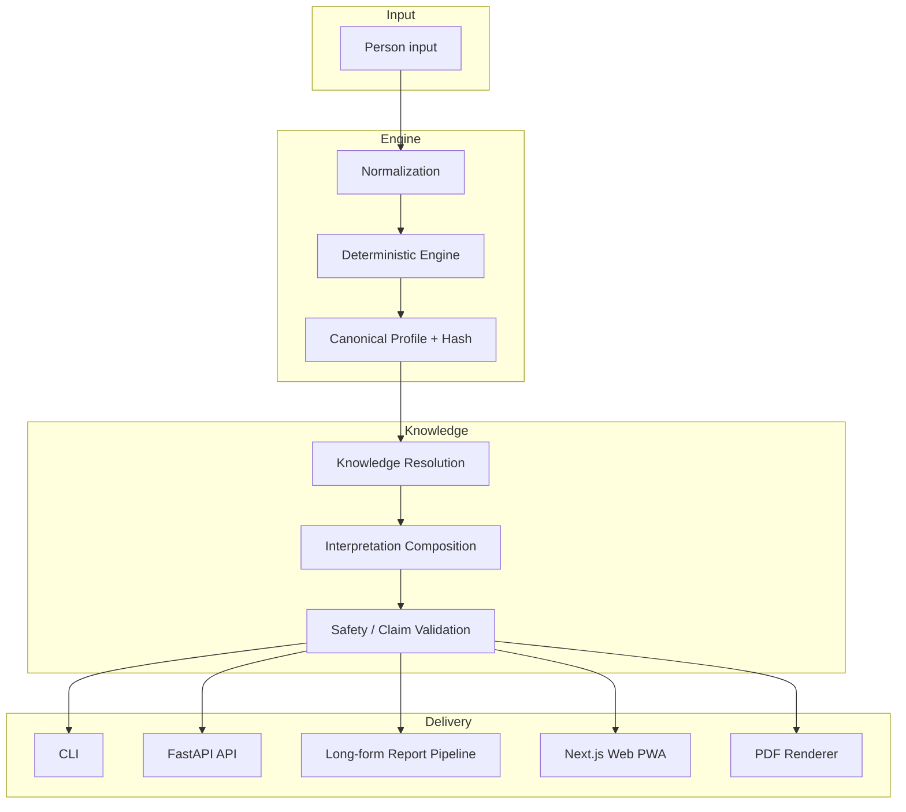

# NUMRA / AVENYTH — Strukturierter Projektüberblick

> **Stand:** 2026-09-11 · **Quelle:** Read-only-Analyse des Repos (Manifeste, ADRs, Specs, Planning-/Release-Dokumente, CI-Workflow)
> **Evidenz:** Alle Zahlen sind als `BERICHTET` (aus Repo-Artefakten übernommen) bzw. `UNVERIFIZIERT` (in diesem Lauf nicht nachgemessen) gekennzeichnet. Es wurden keine Kommandos ausgeführt und keine Geheimnisse ausgelesen.
> **Hinweis:** Für `GEMESSEN`-Evidenz (Messskripte, Abhängigkeits-Audits, Coverage) ist ein separater Lauf mit Kommando-Ausführung nötig — siehe §11.

---

## 1. Management Summary

`numra-v1` ist ein **deterministisches Numerologie-/Beziehungsentwicklungs-Monorepo** mit klarer Schichten-Trennung. Der Kern ist eine reine Python-Rechenengine ohne I/O, LLM oder DB; darüber liegen eine stateless FastAPI-Boundary, ein Next.js-PWA-Frontend, ein interner PDF-Renderer und ein generierter TypeScript-Client. Das System ist **dokumentations- und teststark** (13 ADRs, formale Canon-Spec, 12 Required-CI-Checks, Golden-/Property-/System-E2E-Tests) und **produktiv deployed** (V1.6 B, Tailnet-only).

Das Projekt befindet sich im **additiven V2-Ausbau („AVENYTH")**: V1.6 ist abgeschlossen und live; V2 wird schrittweise auf demselben Stack aufgebaut. Der aktuelle Arbeitsstand ist **Segment C**: **WEB-06b** (Configurable Check-ins Frontend, PR #55) und **WEB-07** (Shared Tasks UI, PR #57) sind abgeschlossen und auf `main` verifiziert. **Nächster Schritt: PR-V2-08 (Roadmaps + Shared Reflection).**

**Kernprinzip:** *NUMRA rät nicht.* Jeder numerologische Wert stammt aus der deterministischen Engine; das LLM erklärt nur, rechnet nie (ADR-003, ADR-011). *NO EVIDENCE → NO CLAIM.*

---

## 2. Projektstruktur

### 2.1 Monorepo-Layout

| Pfad | Verantwortung | Sprache/Stack |
|---|---|---|
| [`packages/engine-numerology`](packages/engine-numerology) | Deterministischer Rechenkern, kein I/O/DB/LLM | Python (uv) |
| [`packages/engine-interpretation`](packages/engine-interpretation) | Knowledge-Loader, regelbasierter Komponist, LLM-Provider-Interface, Report-Pipeline | Python |
| [`packages/engine-relationship-interpretation`](packages/engine-relationship-interpretation) | Beziehungs-/Shadow-/Copilot-Interpretation | Python |
| [`packages/engine-astrology`](packages/engine-astrology) | Nur Typ-Interface, `FEATURE_DISABLED_NO_CANON` | Python |
| [`packages/schema`](packages/schema) | Generierter TS-Client aus `openapi/numra-v1.json` | TypeScript |
| [`apps/api`](apps/api) | Stateless FastAPI: Auth, People, Calcs, Reports, Relationships, Workspaces, Check-ins, Tasks, Admin | Python/FastAPI |
| [`apps/api`](apps/api) (worker) | Report-Job-Queue-Poller (`numra_api.worker`), gleiche Codebasis | Python |
| [`apps/web`](apps/web) | Next.js/React/TS PWA-Frontend | TypeScript |
| [`apps/pdf`](apps/pdf) | Interner Playwright/Chromium-PDF-Renderer (kein öffentlicher URL-Surface) | Node |
| [`knowledge/`](knowledge) | Versionierte deutsche Interpretationsinhalte (YAML) | YAML |
| [`specs/`](specs) | `canon-spec.md`, `profile.schema.json`, V2-Specs, Phasen-Evidenz | Markdown/JSON |
| [`fixtures/canonical`](fixtures/canonical) | Golden-Referenzprofil (Lukas Springer) | JSON |

### 2.2 Import-/Abhängigkeitsordnung

```
numra_numerology → numra_interpretation → numra_relationship_interpretation → numra_api
```

Die Engine importiert **nichts** aus anderen NUMRA-Paketen (Anti-Leak-Test `test_no_golden_leakage.py`).

### 2.3 Toolchain & Manifeste

- **Python:** `uv` Workspace, Python 3.11+, `ruff` (line-length 100), `mypy --strict`, `pytest` + `hypothesis` + `pytest-cov` ([`pyproject.toml`](pyproject.toml))
- **Node:** `pnpm@9.15.0`, Node 20+, Workspaces `apps/web`, `apps/pdf`, `packages/schema` ([`pnpm-workspace.yaml`](pnpm-workspace.yaml))
- **Infra:** Docker Compose mit 7 Services (`postgres`, `migrate`, `api`, `worker`, `analysis-worker`, `redis`, `pdf`, `web`) ([`docker-compose.yml`](docker-compose.yml))

---

## 3. Architektur



**Leitprinzipien (ADR-001/003/011):**
- Engine deterministisch, netzwerk-/DB-/LLM-frei; gleiche Eingabe → gleiche Ausgabe.
- LLM nur als Erklärer/Renderer, nie als Rechner.
- Canon-Versionen und Golden-Fixtures werden nie kosmetisch verändert.

**V2-Invarianten ([`specs/v2/architecture.md`](specs/v2/architecture.md)):**
- Kein Rewrite, kein Parallel-Stack — V2 wird additiv auf dem bestehenden Stack aufgebaut.
- Brand „AVENYTH" ist reine Anzeige-Konfiguration; technische Namespaces (`numra_*`, DB-Identifier, `calculation_version`) werden nicht umbenannt.
- Feature-Flags (`AVENYTH_V2_ENABLED`, `AVENYTH_TASKS_ENABLED`, …) bleiben in Produktion deaktiviert, bis das jeweilige Phase-Acceptance-Gate bestanden ist.

---

## 4. Aktueller Status

### 4.1 Produkt-/Release-Stand

| Meilenstein | Status | Beleg |
|---|---|---|
| V1.5 Produktabschluss | ✅ abgeschlossen | [`docs/adr/007-v1-5-product-completion.md`](docs/adr/007-v1-5-product-completion.md) |
| V1.6 A (RBAC + Admin-Backend) | ✅ abgeschlossen | [`README.md`](README.md) §V1.6 A |
| V1.6 B (Public Platform + Admin Console) | ✅ abgeschlossen, live | [`docs/releases/v1.6-b.md`](docs/releases/v1.6-b.md) |
| V2 Phase 0 (Spec-Freeze) | ✅ abgeschlossen | [`specs/v2/architecture.md`](specs/v2/architecture.md) |
| V2 Segment B (PR-WEB-01–04) | ✅ abgeschlossen | [`docs/planning/reality-check-2-closure.md`](docs/planning/reality-check-2-closure.md) |
| V2 Segment C — WEB-05 (Relationship/Shadow) | ✅ gemergt (#48, #50) | [`docs/planning/avenyth-web-execution-state.md`](docs/planning/avenyth-web-execution-state.md) |
| V2 Segment C — WEB-06a (Check-ins Backend) | ✅ gemergt (PR #53) | [`docs/planning/pr-web-06a-evidence.md`](docs/planning/pr-web-06a-evidence.md) |
| V2 Segment C — WEB-06b (Check-ins Frontend) | ✅ gemergt (PR #55) | [`docs/planning/pr-web-06b-evidence.md`](docs/planning/pr-web-06b-evidence.md) |
| V2 Segment C — WEB-07 (Shared Tasks UI) | ✅ gemergt (PR #57) | [`docs/planning/pr-web-07-evidence.md`](docs/planning/pr-web-07-evidence.md) |
| V2 Segment C — PR-V2-08 (Roadmaps + Shared Reflection) | ⏳ **offen, nächster Schritt** | [`docs/planning/avenyth-web-execution-state.md`](docs/planning/avenyth-web-execution-state.md) |

### 4.2 Verifizierter Implementierungsstand

- **`VERIFIED_IMPLEMENTATION_MAIN_SHA`:** `935508c645bb8a923f958bfab5d34b5aacdb5af9` (WEB-07 Squash-Merge-Commit)
- **Letzter grüner Implementierungs-`main`:** `935508c6…`
- **Letzter gemergter Implementierungs-PR:** #57 (WEB-07)
- **CI:** PR-CI `34564656299` und Post-Merge-CI `34565329664` jeweils **12/12 Required Checks grün** (BERICHTET)
- **Offene Blocker:** keine (BERICHTET, [`docs/planning/avenyth-web-execution-state.md`](docs/planning/avenyth-web-execution-state.md) Z. 12)

### 4.3 Test-/Qualitätsstand (BERICHTET)

- Python-Vollsuite: **747 passed** (WEB-06a-Abschluss), Engine-Coverage **100 %** (110 Tests), Coverage-Gate ≥90 %.
- Web (WEB-07-Stand): **261 Tests / 58 Dateien**, ESLint + `tsc --noEmit` + `next build` grün.
- Echte Alembic-Migrationssuite: **10 passed**.
- 12 Required-CI-Checks (siehe §6).

---

## 5. Offene Punkte & nächste Schritte

### 5.1 Unmittelbar nächster Schritt

**PR-V2-08 — Roadmaps + Shared Reflection** (laut Execution State der nächste Abschnitt):
- Backend-Anteile teils sichtbar: Migration `e2f3a4b5c6d7_roadmaps_shared_reflection.py` existiert bereits.
- Frontend-/Abschlussstatus je Phase ist aus den vorliegenden Artefakten nicht verifiziert.
- Quelle: [`docs/planning/avenyth-web-execution-state.md`](docs/planning/avenyth-web-execution-state.md) Z. 10

### 5.2 Verbleibende V2-PRs (laut [`specs/v2/api-contract.md`](specs/v2/api-contract.md) §53)

| PR | Inhalt | Status |
|---|---|---|
| PR-V2-08 | Roadmaps + Shared Reflection | **nächster Schritt** |
| PR-V2-09 | Private + Shared Copilot | offen |
| PR-V2-10 | Dissolution + Account Deletion + Privacy Closure | offen |
| PR-V2-11 | Evidence Layer (Phase 6) | offen |
| PR-V2-12 | Native Mobile | offen (nach V2 Core) |

> Hinweis: Einige Backend-Anteile dieser Phasen sind bereits als Migrationen/Repositories im Repo sichtbar (z. B. `shared_task_system`, `roadmaps_shared_reflection`, `private_shared_copilot`, `evidence_layer`), der Frontend-/Abschlussstatus je Phase ist jedoch nicht aus den vorliegenden Artefakten verifiziert.

### 5.3 Bekannte offene technische Punkte

- **Astrologie-Engine** ohne Implementierung (`FEATURE_DISABLED_NO_CANON`, ADR-006) — kritischer Produkt-Blocker.
- **Live-LLM-Verifikation (Ollama)** `NOT_VERIFIED` — kritischer Betriebspunkt.
- **CSP ohne `nonce`/`strict-dynamic`** (`unsafe-inline`).
- **Frontend-Kernkomponenten** (AppShell, Auth, Forms, Design-System) ungetestet.
- **Kein Monitoring/Observability**, kein Metrik-Export, kein Prod-IaC im Repo.
- **Kein `CHANGELOG.md` / `CONTRIBUTING.md` / `docs/architecture.md`**.

---

## 6. CI/CD & Qualitätstore

12 Required Checks ([`.github/workflows/ci.yml`](.github/workflows/ci.yml)):

1. `lint-python` (ruff format + check)
2. `python-typecheck` (mypy --strict)
3. `unit-and-property-tests` (Postgres/Redis, Coverage ≥90 %)
4. `no-golden-leakage`
5. `dependency-security` (`pnpm audit --prod --audit-level=high` + `pip-audit`)
6. `schema-and-openapi-drift`
7. `web-lint-typecheck-build-test`
8. `pdf-service-tests`
9. `docker-build`
10. `docker-compose-e2e` (inkl. Log-/Secret-Audit)
11. `playwright` (gemockt)
12. `system-e2e` (echter Stack, kein Mocking)

Zusätzlich: `rc2-journey.yml` (Workflow-Dispatch, Zwei-Konten-Journey).

**Wichtiger behobener Befund:** Der latente „Commit-nach-Response"-Bug (Stale Read) wurde als Root Cause der CI-Instabilität identifiziert und in PR #44 behoben (`Depends(get_db, scope="function")` + pure-ASGI-Middleware). Details: [`docs/planning/ci-flake-root-cause.md`](docs/planning/ci-flake-root-cause.md).

---

## 7. Risiken

### 7.1 Kritisch

| Risiko | Beschreibung | Quelle |
|---|---|---|
| Astrologie-Feature unerfüllt | Engine nur Interface, wirft `NotImplementedError` | [`docs/analyze/gap-analyse.md`](docs/analyze/gap-analyse.md) G-ARCH-01 |
| LLM-Pfad unverifiziert | `LIVE_LLM_SMOKE = NOT_VERIFIED` (kein API-Key in CI) | G-SEC-01 |

### 7.2 Hoch

| Risiko | Beschreibung | Quelle |
|---|---|---|
| CSP-Schwäche | `script-src 'self' 'unsafe-inline'`, kein nonce | G-SEC-02 |
| Frontend-Testlücke | Kern-UI ungetestet | G-TST-01 |
| Prod-IaC/Backup fehlt | `compose.production.yml` nur extern auf VPS | G-INF-01 |
| Kein Monitoring/Alerting | Blindheit bei Störungen | G-INF-02 |
| Doku/Code-Divergenz RBAC | Runbook vs. Repo-Stand | G-ARCH-02 |

### 7.3 Restunsicherheit (CI-Fix)

Der deterministische Regressionstest beweist Mechanismus + Fix des Stale-Read-Bugs, aber die exakte Latenz-Kette auf GitHub-Runnern wurde nie direkt gemessen. Bei erneutem Auftreten liefern `[CI-DIAG]`-Logs + Playwright-Traces die Zweitanalyse-Daten. `scope="function"` ist ein jüngeres FastAPI-Feature (0.115+); bei künftigen Streaming-/SSE-Routen wäre die pure-ASGI-Middleware die konservativere Teilabsicherung.

---

## 8. Technische Schulden (Konsolidiert)

Gesamtbild: **geringe bis mittlere Schuld**, zwei kritische Einzelposten. Vollständiges Inventar: [`docs/analyze/technical-debt.md`](docs/analyze/technical-debt.md).

**Priorisierte Handlungsempfehlungen (ohne Zeit-/Aufwandsschätzung):**

1. Astrologie-Spec + deterministische Engine (kritisch).
2. Live-LLM-Smoke via Managed Secret (kritisch, Quick Win).
3. CSP nonce/strict-dynamic.
4. Frontend-Komponenten-Tests (AppShell/Auth/Forms).
5. Prod-IaC + Backup/Retention + Monitoring.
6. Doku: CHANGELOG, CONTRIBUTING, Architektur-Diagramm.
7. Refactoring langer Funktionen/Form-Duplikate.
8. Renovate/Dependabot.

---

## 9. Sicherheit & Datenschutz (Ist-Stand, BERICHTET)

- Argon2id-Passwort-Hashing; Session-Tokens nur als SHA-256-Hash gespeichert; Cookies `HttpOnly`/`SameSite=Lax`/`Secure` (Prod).
- CSRF via Double-Submit-Cookie auf allen zustandsändernden Requests.
- `ALLOW_SELF_SIGNUP` default `false`; Anti-Enumeration bei Login/Registrierung/Forgot-Password.
- Strukturierte Fehlercodes, keine stillen Fallbacks.
- PII-sicheres Logging (keine Namen/Geburtsdaten/Prompts in Logs).
- Dependency-Audit als CI-Gate (`pnpm audit` + `pip-audit`).
- Account-Löschung mit DB-Cascade, end-to-end getestet.
- Kein echtes `.env` im Repo (nur `.env.example`).

---

## 10. Fazit

Das Projekt ist **architektonisch reif, teststark und produktiv stabil** (V1.6 B live). Der V2-Ausbau schreitet **additiv und gate-basiert** voran; WEB-06b und WEB-07 sind abgeschlossen, der unmittelbar nächste Schritt ist **PR-V2-08 (Roadmaps + Shared Reflection)**. Die zwei kritischen Altlasten (Astrologie-Engine, LLM-Verifikation) sowie die Infrastruktur-/Observability-Lücken bleiben die wichtigsten strategischen Baustellen jenseits des laufenden Feature-Ausbaus.

---

## 11. Methodik, Evidenzstufen & Messlücken

### 11.1 Evidenzstufen dieses Laufs

| Stufe | Bedeutung | Verwendung in diesem Dokument |
|---|---|---|
| `GEMESSEN` | in diesem Lauf durch ein Kommando erzeugt | **keine** — es wurden keine Kommandos ausgeführt |
| `BERICHTET` | aus einem Repo-Artefakt übernommen, nicht nachgeprüft | alle Status-, Test- und CI-Angaben |
| `UNVERIFIZIERT` | in diesem Lauf nicht bestimmbar | Frontend-/Abschlussstatus einzelner V2-Phasen |

### 11.2 Offene Messlücken (für einen Folge-Lauf mit Kommando-Ausführung)

| Leitmetrik | Notwendiges Kommando | Warum sie fehlt |
|---|---|---|
| Zyklische Importe / God-Module | `python scripts/inventar.py .` | Architect-Mode ohne Kommando-Ausführung |
| Große Dateien / lange Funktionen / Duplikate | `python scripts/inventar.py .` | dito |
| Veraltete Abhängigkeiten | `pnpm outdated` / `uv pip list --outdated` | dito |
| Abhängigkeits-Schwachstellen | `pnpm audit --json` / `pip-audit --format json` | dito |
| Coverage (Python/Web) | `uv run pytest --cov` / `pnpm --filter @numra/web test -- --coverage` | dito |
| TODO/FIXME/unsichere Muster | `python scripts/muster_scan.py .` | dito |
| Git-Hotspots / Working-Tree-Status | `python scripts/git_metriken.py .` | dito |

### 11.3 Grenzen

Statische Lese-Analyse des Repositoriums: Struktur, Manifeste, ADRs, Specs, Planning-/Release-Dokumente, CI-Konfiguration. Nicht durchgeführt: Laufzeit-/Lastanalyse, Profiling, Penetrationstests, Prüfung der fachlichen Richtigkeit. Ein leerer Befundbereich bedeutet, dass die genannten Prüfungen nichts gefunden haben — nicht, dass es nichts zu finden gibt.
